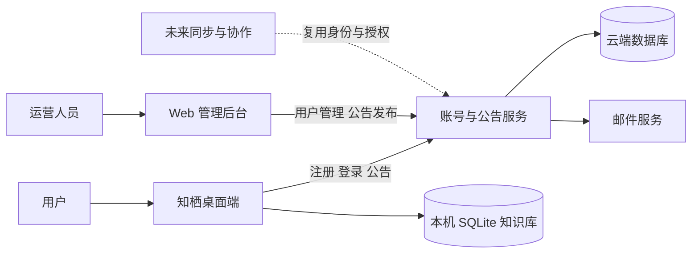

# 知栖账号、管理后台与公告一期设计

## 目标

为知栖桌面端建立统一账号入口，并提供一个仅供运营人员使用的 Web 管理后台。第一期解决三件事：

1. 用户通过邮箱注册、验证和登录后使用桌面端。
2. 运营人员可查询和管理用户账号。
3. 运营人员可发布全体公告，已登录用户在应用内收到未读提醒并查看内容。

知识库仍然完全保存在用户设备的本地 SQLite 数据库中；云端不得接收、保存或分析页面、块、附件、白板、数据表或思维导图内容。

## 已确认的产品决定

- 用户必须注册、验证邮箱并登录，才能进入知栖桌面端。
- 登录方式为邮箱加密码，不采用首期验证码登录。
- 支持忘记密码：邮件发送一次性重置链接或验证码，用户验证后设置新密码。
- 公告仅面向全部已登录用户；首期不做用户分群、版本或系统定向。
- 桌面端在启动和从后台恢复时拉取公告；顶部显示未读红点，用户在消息中心阅读。
- 不做操作系统级通知推送。
- 管理员可以查看用户、搜索用户、停用或恢复用户，以及发布、编辑和下线公告。

## 方案与边界

采用独立的云端账号与公告服务，并配套独立 Web 管理后台。桌面端以 HTTPS 调用该服务；本地工作区继续经现有 Tauri/SQLite 边界读写。

首期不建设云同步、协作空间、成员权限、订阅/计费、系统通知推送、用户分群或使用行为分析。未来同步与协作只复用此处的用户 ID、会话和角色模型，另行设计数据上传、授权和冲突处理。

## 云端数据模型

云端只维护以下最小数据：

| 实体 | 关键字段 | 用途 |
| --- | --- | --- |
| users | id、email、password_hash、email_verified_at、status、created_at | 用户身份与账号状态 |
| verification_tokens | user_id、token_hash、expires_at、used_at | 邮箱验证与重发控制 |
| password_reset_tokens | user_id、token_hash、expires_at、used_at | 密码重置 |
| sessions | user_id、refresh_token_hash、device_name、expires_at、revoked_at | 多设备登录与退出/停用失效 |
| admins | user_id、role | 后台访问控制；首期仅 `admin` |
| announcements | id、title、content、status、published_at、created_by | 公告草稿、发布与下线 |
| announcement_reads | announcement_id、user_id、read_at | 未读数与阅读状态 |

密码、验证令牌和刷新令牌只保存不可逆哈希。访问令牌为短期令牌；刷新令牌可撤销。用户被停用后，服务端撤销其全部会话，桌面端下次请求必须回到登录页。

## 用户流程

1. 用户在桌面端填写邮箱和密码，服务端创建未验证账号并发送验证邮件。
2. 用户通过邮件链接或验证码完成验证，随后登录进入应用。
3. 桌面端安全保存会话凭证；每次启动和恢复时刷新会话并请求公告摘要。
4. 有未读公告时显示红点；用户打开消息中心后获取详情，阅读即写入已读记录。
5. 用户忘记密码时，服务端始终返回同一提示文案，避免泄露邮箱是否已注册；有效验证后才能设置新密码。
6. 用户被停用时，当前会话在下一次服务端请求失效；本地知识库文件不被删除或上传。

## 管理后台

后台只允许 `admin` 角色访问，并要求与普通用户登录隔离的入口或明确的管理员权限校验。

- 仪表盘：注册用户数、已验证用户数、停用用户数、最近公告状态；不展示知识库内容或行为画像。
- 用户管理：按邮箱和状态搜索，查看注册时间、验证状态、最近登录时间、账号状态；支持停用和恢复，并记录操作者与时间。
- 公告管理：草稿、编辑、预览、发布、下线；发布内容至少包括标题、正文和发布时间。发布后对所有已登录用户生效。
- 管理员管理：一期仅通过部署/数据库初始化指定首位管理员，不在后台制作管理员自助管理界面。

## 安全与可靠性

- 全链路 HTTPS；邮箱地址规范化并设置唯一约束。
- 密码使用成熟密码哈希算法；服务端不记录明文密码或明文令牌。
- 注册、验证邮件、登录、重置密码接口均做频率限制；登录失败采用统一错误提示。
- 管理后台启用基于角色的授权，所有停用、恢复和公告发布写入审计记录。
- 服务端异常、邮件发送失败和网络不可用须给出可理解且可重试的提示；桌面端在离线时继续可用已登录会话下的本地知识库，但无法拉取公告。

## 实施顺序

1. 选择云端部署环境、数据库和邮件服务，建立账号与会话 API。
2. 建立管理后台的管理员登录、用户管理和公告发布。
3. 在桌面端增加认证页面、会话管理和公告消息中心。
4. 覆盖关键流程测试：注册验证、登录、密码重置、会话撤销、管理员授权、公告发布与已读状态。

## 验收标准

- 已验证邮箱用户可在桌面端注册、登录、退出和完成密码重置。
- 未验证或被停用用户无法进入应用。
- 管理员可搜索用户并停用/恢复账号，普通用户无法访问后台接口或页面。
- 管理员发布一条公告后，已登录用户重启或恢复应用能看到未读红点和公告正文；阅读后红点消失。
- 任意一期云端数据备份中不包含用户的知识库内容或本机资产。
